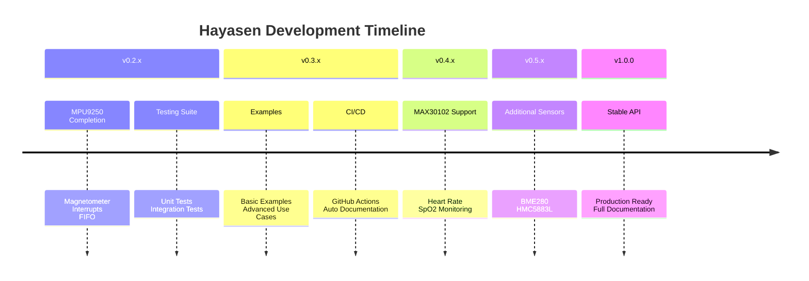

# Hayasen

[](https://crates.io/crates/hayasen)
[](https://docs.rs/hayasen)
[](LICENSE-APACHE)
[](https://rust-lang.org)

> ⚠️ **Warning: Early Development Stage**
> 
> This library is currently under active development and has not been thoroughly tested.
> Use in production systems at your own risk. APIs may change without notice.

Hayasen is an Embedded Rust library designed to simplify sensor integration in embedded systems. 
It provides unified, type-safe interfaces for various sensors with a focus on ease of use and reliability.

## 🚀 Currently Supported Sensors

- **MPU9250** - 9-axis motion tracking device (accelerometer, gyroscope, temperature) - *Work in Progress*

## 📦 Installation

Add `hayasen` to your `Cargo.toml`:

```toml
[dependencies]
hayasen = { version = "0.1", features = ["mpu9250"] }   # For MPU9250 support
```

## 🎯 Quick Start

```rust
use hayasen::prelude::*;
use embedded_hal::i2c::I2c;

fn main() -> Result<(), Error<MyI2CError>> {
    // Easy initialization with default settings
    let mut mpu = HayasenFunctions::create_mpu9250_default(i2c, 0x68)?;
    
    // Read sensor data
    let acceleration = HayasenFunctions::read_accel(&mut mpu)?;
    let temperature = HayasenFunctions::read_temp_c(&mut mpu)?;
    
    println!("Temperature: {:.1}°C", temperature);
    println!("Acceleration: {:?} g", acceleration);
    
    Ok(())
}
```

## 🔧 Features

- `mpu9250` - Enables MPU9250 motion sensor support (enabled by default)
- More sensors coming soon!

## 📚 Documentation

- [API Documentation](https://docs.rs/hayasen) - Complete API reference
- [Examples](./examples/) - Practical usage examples   (Coming Soon)
- [Contributing Guidelines](./CONTRIBUTING.md) - How to contribute to the project

## 🏗️ Project Structure

```
hayasen/
├── src/
│   ├── lib.rs          # Main library entry point
│   ├── error.rs        # Unified error types
│   ├── functions.rs    # Function registry system
│   └── mpu9250.rs      # MPU9250 sensor implementation
├── examples/           # Usage examples
└── tests/              # Integration tests
```

## 📝 License

This project is dual-licensed under either:
- Apache License, Version 2.0 [Apache-2.0](LICENSE-APACHE)
- MIT license [MIT](LICENSE-MIT)

## 🙏 Acknowledgments
- Inspired by various embedded Rust driver libraries
- Thanks to the Rust embedded working group for excellent tools and guidance
- Community contributors and testers

## 🐛 Issue Reporting

Found a bug or have a feature request? Please open an [issue](https://github.com/Vaishnav-Sabari-Girish/Hayasen/issues) on GitHub.


## 🔮 Roadmap

### 🎯 Short-term Goals (v0.2.0 - v0.5.0)

- [ ] **Complete MPU9250 implementation and testing**
  - [ ] Magnetometer support (AK8963)
  - [ ] Self-test functionality
  - [ ] Motion detection interrupts
  - [ ] FIFO buffer support
  - [ ] Comprehensive unit tests
  - [ ] Integration tests with hardware

- [ ] **Add comprehensive test suite**
  - [ ] Unit tests for all public APIs
  - [ ] Integration tests with mock I2C
  - [ ] Hardware-in-the-loop testing
  - [ ] Continuous integration setup
  - [ ] Code coverage reporting

- [ ] **Create more usage examples**
  - [ ] Basic sensor reading example
  - [ ] Interrupt-driven motion detection
  - [ ] Data logging application
  - [ ] Multi-sensor fusion example
  - [ ] RTOS integration examples

### 🚀 Medium-term Goals (v0.6.0 - v0.9.0)

- [ ] **Add MAX30102 heart rate sensor support**
  - [ ] Heart rate monitoring
  - [ ] Oxygen saturation (SpO2) measurement
  - [ ] FIFO data reading
  - [ ] Interrupt configuration
  - [ ] Temperature reading

- [ ] **Add CI/CD pipeline**
  - [ ] GitHub Actions for testing
  - [ ] Automated documentation deployment
  - [ ] Release automation
  - [ ] Crate publishing automation
  - [ ] Cross-compilation testing

### 🌟 Long-term Goals (v1.0.0+)

- [ ] **Support for more sensor types**
  - [ ] BME280 (Temperature, Humidity, Pressure)
  - [ ] BMP180/BMP280 (Pressure)
  - [ ] HMC5883L (Magnetometer)
  - [ ] ADXL345 (Accelerometer)
  - [ ] TMP36/TMP102 (Temperature)

- [ ] **Advanced features**
  - [ ] Sensor fusion algorithms
  - [ ] Power management utilities
  - [ ] Async/await support
  - [ ] No-alloc mode for tiny systems
  - [ ] WebAssembly support for simulation

- [ ] **Ecosystem integration**
  - [ ] Embassy framework support
  - [ ] RTIC framework integration
  - [ ] defmt logging support
  - [ ] Probe-rs debugging support
  - [ ] Platform-agnostic drivers

### 📊 Version Timeline




## 📊 Project Activity

### Stargazers over time

[](https://starchart.cc/Vaishnav-Sabari-Girish/Hayasen)

### Stargazers

[](https://github.com/Vaishnav-Sabari-Girish/Hayasen/stargazers)