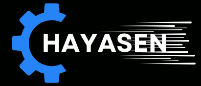

<p align="center">
  
</p>

# Hayasen

[](https://crates.io/crates/hayasen)
[](LICENSE-APACHE)
[](https://rust-lang.org)

> ⚠️ **Warning: Early Development Stage**
> 
> This library is currently under active development and has not been thoroughly tested.
> Use in production systems at your own risk. APIs may change without notice.

Hayasen is an Embedded Rust library designed to simplify sensor integration in embedded systems. 
It provides unified, type-safe interfaces for various sensors with a focus on ease of use and reliability.

## 🚀 Currently Supported Sensors

- **MPU9250** - 9-axis Inertial Measurement Unit (accelerometer, gyroscope, temperature, magnetometer) - *Work in Progress*
- **MPU6050** - 6-axis Inertial Measurement Unit (accelerometer, gyroscope, temperature)


## Progress 

Click here to check the current progress of the library

[Progress](./progress.md)

## 📦 Installation

Add `hayasen` to your `Cargo.toml`:

```toml
[dependencies]
hayasen = { version = "*", features = ["mpu9250"] }   # For MPU9250 support
```

## 🎯 Quick Start

```rust
use hayasen::prelude::*;
use hayasen::mpu9250_hayasen;

fn main() -> Result<(), Error<YourI2cError>> {
    // Setup I2C (platform-specific)
    let i2c = setup_i2c();
    
    // Initialize sensor with default configuration
    let mut sensor = mpu9250_hayasen::create_default(i2c, 0x68)?;
    
    // Read all sensor data (temp, accel, gyro)
    let (temperature, acceleration, angular_velocity) =
        mpu9250_hayasen::read_all(&mut sensor)?;
    
    println!("Temperature: {:.2}°C", temperature);
    println!("Acceleration: [{:.3}, {:.3}, {:.3}] g",
             acceleration[0], acceleration[1], acceleration[2]);
    println!("Angular Velocity: [{:.3}, {:.3}, {:.3}] dps",
             angular_velocity[0], angular_velocity[1], angular_velocity[2]);
    
    Ok(())
}
```

## 🔧 Features

- `mpu9250` - Enables MPU9250 Inertial Measurement Unit support (enabled by default)
- `mpu6050` - Enables MPU6050 Inertial Measurement Unit support 
- More sensors coming soon!

## 📚 Documentation

- [API Documentation](https://vaishnav.world/Hayasen) - Complete API reference
- [Examples](https://github.com/Vaishnav-Sabari-Girish/Hayasen-Examples) - Practical usage examples   (Coming Soon)
- [Contributing Guidelines](./CONTRIBUTING.md) - How to contribute to the project

## 🏗️ Project Structure

```
hayasen/
├── src/
│   ├── lib.rs          # Main library entry point
│   ├── error.rs        # Unified error types
│   ├── functions.rs    # Function registry system
│   ├── mpu9250.rs      # MPU9250 sensor implementation
│   └── mpu6050.rs      # MPU6050 sensor implementation
├── examples/           # Usage examples
└── tests/              # Integration tests
```

## 📝 License

This project is dual-licensed under either:
- Apache License, Version 2.0 [Apache-2.0](LICENSE-APACHE)
- MIT license [MIT](LICENSE-MIT)

## 🙏 Acknowledgments
- Inspired by various embedded Rust driver libraries
- Thanks to the Rust embedded working group for excellent tools and guidance
- Community contributors and testers

## 🐛 Issue Reporting

Found a bug or have a feature request? Please open an [issue](https://github.com/Vaishnav-Sabari-Girish/Hayasen/issues) on GitHub.


## TODO

- [ ] Add MPU9250 SPI Support 
- [ ] Add MPU6050 SPI Support
- [ ] Add support for BME280 (I2C and SPI)
- [ ] Add support for HC-SR04 Ultrasonic Sensor
- [ ] Add support for MQ135 Gas sensor


## 📊 Project Activity

### Stargazers over time

[](https://starchart.cc/Vaishnav-Sabari-Girish/Hayasen)

### Stargazers


### Contributors 

<a href="https://github.com/Vaishnav-Sabari-Girish/Hayasen/graphs/contributors">
  
</a>

### Forkers 


